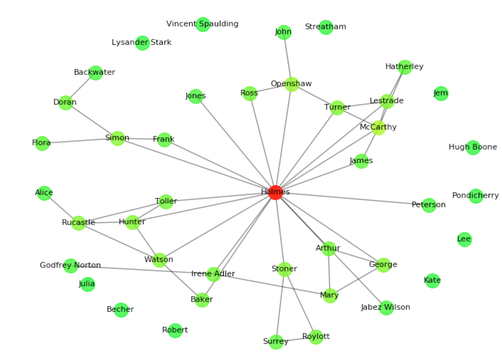

# Nodebook

Nodebook is a little python library which extracts characters from plain text books and 
uses graph theory to perform analyses on character types,
importances and interactions. 

## Installation

Dependencies are `SpaCy`, `matplotlib` and `networkx 1.11`. Install using the commands below.

```
git clone https://github.com/Buroni/nodebook.git
pip install spacy
pip install networkx --version==1.11 
pip install matplotlib
```

To run the library outside the root directory, you will need to update `PYTHONPATH` to point to the directory which contains the 
nodebook folder:

```
PYTHONPATH=/path/to/parent/:$PYTHONPATH
```

## Usage

There are several examples in the 'examples' directory which show some different usages.

### Drawing a character graph
This quick example uses nodebook to find the main character in 
Arthur Conan Doyle's *The Adventures of Sherlock Holmes*, displays 
a graph of characters and dumps the graph
into a json file.

```python
from nodebook import book

sherlock = book("http://www.gutenberg.org/cache/epub/1661/pg1661.txt")

print("Most central characters: " + str(sherlock.important_characters(8)))

pov = "first person" if sherlock.is_first_person else "third person"
print("Point of view: " + pov)


sherlock.dump("sherlock.json")

sherlock.graph(with_labels=True, node_size=200)

```

This example will produce the following:

```python
Most central characters: [u'Holmes', u'McCarthy', u'Openshaw', u'Simon', u'Rucastle', u'Mary', u'Hunter', u'Watson']
Point of view: third person
```



### Performance

After the first time the plain text file is processed,
it is recommended to `dump` the graph into a json file and load
this rather than the original book in subsequent executions of 
the program. The post-analysis json file is much quicker to read
than a full book.

```python
lotr = book("fellowship.json")
```

## Documentation

#### `book(file_path, char_min_count=2, interaction_measure="same_line", blacklist=[])`

Initialise a new `book` object. 

`file_path` can either be a local path or URL to a raw txt file of the book, or a local json dump file.

`char_min_count` is the number of times a character
should appear in the book before they are stored in the graph. 

nodebook measures interactions between characters: 
`interaction_measure` is the definition of an "interaction"
which should be used. It can either be `"same_line"`, meaning
that two characters are seen as interacting if they appear on the same line,
or `"verb"`, meaning that they interact if they appear as a subject
and object of the same transitive verb. For example, the sentence 
*"Jack talks to Jake"* contains an interaction in both measure
methods, but specifically using the `"verb"` measure where Jack
interacts with Jake through the verb *talks*.

`blacklist` is a list of names which should be ignored when
looking for characters.

### `dump(cache_file)`

Dump the current book object into a json file with name specified
by the variable `cache_file`.

### `graph(with_labels=True, node_size=400)`

Draw a matplotlib graph of characters connected by edges representing
 interactions, and colour-coded by
their degree.

### `important_characters(num, metric="degree")`

Return a list of important characters in descending order by some
metric. The metric can be:

* `"degree"` -- measure a character's importance by the number of 
other characters they interacted with.
* `"clustering"` -- measure by the [local clustering co-efficient](https://en.wikipedia.org/wiki/Clustering_coefficient#Local_clustering_coefficient) of each
character in the graph.
* `"centrality"` -- measure by the [betweenness centrality](https://en.wikipedia.org/wiki/Betweenness_centrality) of each character
in the graph.

## Class member variables

### char_list

A list of strings representing the names of characters found
during analysis of the book.

### first_person

A string representing who nodebook thinks the first person is,
if the book is first person. Otherwise defaults to `None`. This 
is worked out by calculating the character which has the highest
[neighbourhood overlap](http://eng.uok.ac.ir/esmaili/teaching/spring2012/sna/slides/Lecture2.pdf) with `[FP]` (the "first person" character tag).


### is_first_person

A boolean representing whether nodebook believes the book
is written in first person. This is worked out by counting the occurrences
of the pronoun *"I"* outside quotation marks.

## Using native NetworkX functions

A `book` object contains a native NetworkX graph `G`, on which you can perform native Networkx methods. For example

```python
myBook = book('my_book.json')
centrality = networkx.betweenness_centrality(myBook.G)
```

